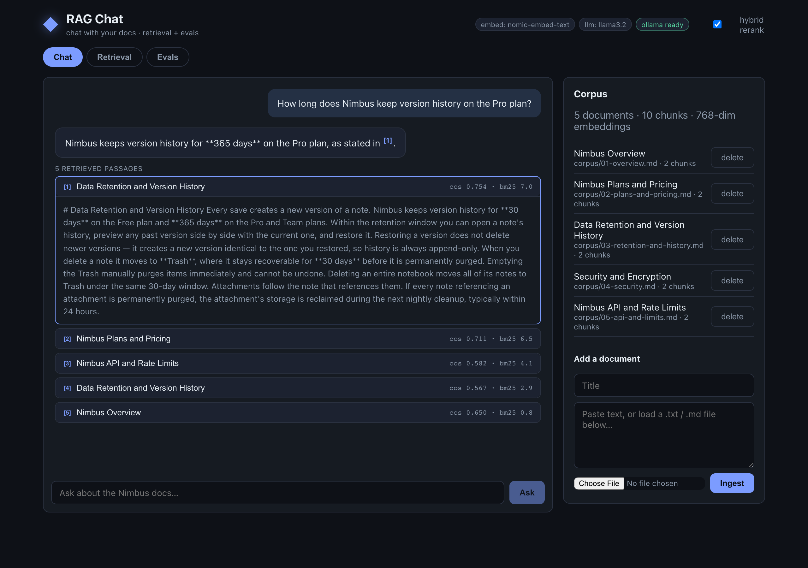

# RAG Chat — Chat With Your Docs

[](https://github.com/shaqa3/rag-chat/actions/workflows/ci.yml)
   

A **retrieval-augmented generation** chat app that answers questions over your
own documents — running entirely **locally on Ollama**, no API keys, no data
leaving your machine. Built with **Python (FastAPI)** and **React (Vite +
TypeScript)**.

Chat wrappers are a dime a dozen, so the focus here is the part almost nobody
shows: **retrieval quality and a real evaluation harness**. Every answer is
grounded in retrieved passages, cites them inline, and the assistant **refuses
rather than hallucinate** when nothing relevant is found. Retrieval is **hybrid**
(dense embeddings + BM25, fused with Reciprocal Rank Fusion), and a labelled
eval set measures whether the design choices actually pay off.

The vector store is a roll-your-own **SQLite + NumPy** index — no Chroma, FAISS,
or pgvector — so the retrieval mechanics are visible rather than hidden behind a
library, and the whole thing runs with just `python` + `npm` (+ Ollama).

## The RAG pipeline

```
              ingest                         query time
   ┌──────────────────────────┐   ┌─────────────────────────────────────────┐
   │ document                 │   │ question                                │
   │   │ chunk (sentence-      │   │   │ embed (Ollama)                      │
   │   ▼  packed, overlapping) │   │   ▼                                     │
   │ chunks                   │   │ ┌─ dense: cosine over NumPy matrix ──┐   │
   │   │ embed (Ollama)       │   │ ├─ lexical: BM25 over chunk tokens ──┤   │
   │   ▼                      │   │ ▼                                    ▼   │
   │ vectors ──► SQLite + ────┼──►│ Reciprocal Rank Fusion (rerank)          │
   │             NumPy index  │   │   │ top-k passages                       │
   └──────────────────────────┘   │   ▼                                      │
                                  │ cite-or-refuse gate (cosine ≥ threshold?) │
                                  │   │ yes           │ no                    │
                                  │   ▼               ▼                       │
                                  │ Ollama chat    refuse ("I don't know")    │
                                  │ (streamed, cited [n])                     │
                                  └─────────────────────────────────────────┘
```

## Features

- **Local-first LLM** — embeddings (`nomic-embed-text`) and generation
  (`llama3.2`) both run on a local **Ollama** daemon. Model names are
  configurable; nothing is sent to a third party.
- **Chunking that's a deliberate lever** — documents are split on sentence
  boundaries and packed into overlapping ~220-token windows, so a chunk is a
  coherent unit and facts straddling a boundary stay retrievable from either
  side.
- **Hybrid retrieval + reranking** — dense cosine search *and* BM25 keyword
  search, fused with **Reciprocal Rank Fusion**. Dense handles paraphrase; BM25
  nails exact names, IDs, and error codes; RRF needs no score calibration
  between the two.
- **Citations, always** — answers cite retrieved passages inline (`[2]`), and
  the UI makes each citation clickable to reveal the exact source chunk and its
  retrieval scores.
- **Cite-or-refuse guardrail** — if the best retrieval score is below a
  threshold, the app refuses instead of calling the model. No context, no
  answer.
- **Streaming chat UI** — answers stream token-by-token over Server-Sent Events.
- **Retrieval inspector** — a dedicated view showing exactly which chunks a
  query retrieves, their dense/lexical/fused scores, and whether the refusal
  gate would fire.
- **Evaluation harness** — a labelled question set scored on retrieval (hit@k,
  MRR) *and* answer quality (keyword coverage, grounded rate, accuracy),
  runnable with hybrid on vs off to justify the design.
- **Runs with zero external dependencies too** — a deterministic **offline
  backend** (hashed bag-of-words embeddings + an extractive answerer) exercises
  the entire loop with no GPU or daemon. It's what CI uses.



## Quickstart

### 1. Install Ollama and pull the models

```bash
# https://ollama.com/download — then, with `ollama serve` running:
make ollama-setup          # ollama pull nomic-embed-text && ollama pull llama3.2
```

### 2. Install and run

```bash
make install               # Python venv + npm deps
make dev                   # backend :8000 + chat UI :5173
```

Open <http://localhost:5173>. The bundled **Nimbus** sample corpus (a fictional
product's docs) is ingested on first boot, so you can chat immediately. Try
*"How long does Nimbus keep version history on the Pro plan?"*

### No Ollama? Run the offline backend

Every feature works without a model — embeddings become a hashed projection and
answers become extractive:

```bash
make backend-offline       # or: RAG_EMBED_BACKEND=offline RAG_LLM_BACKEND=offline
make frontend
```

## API

| Method   | Path                    | Description                                    |
| -------- | ----------------------- | ---------------------------------------------- |
| `GET`    | `/api/health`           | Status, store stats, whether Ollama is up      |
| `GET`    | `/api/config`           | Active backends, models, retrieval settings    |
| `GET`    | `/api/documents`        | List ingested documents                        |
| `POST`   | `/api/ingest`           | Ingest `{title, text}` → chunk + embed + store |
| `DELETE` | `/api/documents/{id}`   | Remove a document and its chunks               |
| `POST`   | `/api/search`           | Retrieval inspector: `{query, hybrid, top_k}`  |
| `POST`   | `/api/chat`             | Stream a cited answer (SSE) for `{question}`   |
| `POST`   | `/api/eval`             | Run the eval set with `{hybrid, top_k}`        |

The `/api/chat` stream emits SSE events: `sources` (once), many `token` events,
then `done` — or a single `refusal` when the cite-or-refuse gate fires.

## Retrieval design

**Chunking** (`app/chunk.py`). Chunk size is the single biggest lever on
retrieval quality: too large and one embedding blurs across topics; too small
and a chunk loses the context needed to answer. We split on paragraph → sentence
boundaries and pack sentences into ~`RAG_CHUNK_TOKENS` windows with
`RAG_CHUNK_OVERLAP` tokens of carry-over, so boundary-straddling facts stay
retrievable from both neighbours.

**Hybrid retrieval + RRF** (`app/retrieve.py`). We take the top candidates from
dense cosine search and from BM25, then fuse by rank:

```
score(chunk) = Σ  1 / (60 + rank_in_list)
```

A chunk ranked well by *either* retriever floats up; one ranked well by *both*
wins. RRF is the reranking pass and needs no calibration between cosine's
`[-1, 1]` scale and BM25's unbounded scores.

**Cite-or-refuse** (`app/main.py`). The refusal gate uses the raw best **cosine**
(not the fused score, which has no absolute scale). Below `RAG_MIN_SCORE` the app
returns a refusal and never calls the model — the cheapest, most reliable
hallucination guard there is.

## Evaluation methodology

RAG can fail at two independent layers, so the harness (`app/eval.py`) measures
both:

- **Retrieval** — `hit@k` (a chunk from the labelled relevant doc is in the
  top-k) and **MRR** (`1/rank` of the first relevant chunk). Model-independent.
- **Answer** — keyword **coverage** (expected facts present), **grounded rate**
  (the answer carries a citation), and **accuracy** (retrieved *and* answered
  *and* covered — or correctly **refused** for out-of-corpus questions). The
  eval set deliberately includes unanswerable questions to test the guardrail.

Run it from the UI (Evals tab), the API, or the CLI:

```bash
make eval                  # python -m app.evalcli
```

### Experiment 1: does hybrid reranking help, and what chunk size?

Sweeping `RAG_CHUNK_TOKENS` over the bundled 12-question set on the **offline**
backend (hash embeddings, so it's reproducible in CI):

| chunk_tokens | #chunks | dense-only MRR | **hybrid MRR** |
| -----------: | ------: | -------------: | -------------: |
|           90 |      24 |          0.833 |      **0.925** |
|          150 |      12 |          0.800 |      **0.925** |
|      **220** |      10 |          0.833 |      **0.925** |
|          320 |       5 |          0.825 |      **0.950** |

With the offline backend's *lexical* hash embeddings, hybrid retrieval beats
dense-only at every chunk size — the BM25 half rescues exact-term questions
(rate limits, `429`, "5 GB") that weak embeddings rank too low. `hit@k` is 1.0
throughout on this small corpus, so MRR — *how high* the right chunk ranks — is
the discriminating metric. Reproduce with `RAG_CHUNK_TOKENS=<n> make eval`.

### Experiment 2: does that hold with real embeddings? (No.)

The interesting result. Re-running the same set on **real Ollama**
(`nomic-embed-text` retrieval + `llama3.2` answers, 5 runs, `chunk_tokens=220`):

| retriever   | hit@k | MRR (stable) | coverage — mean [min–max] | grounded — mean [min–max] | accuracy — mean [min–max] |
| ----------- | ----: | -----------: | :-----------------------: | :-----------------------: | :-----------------------: |
| **hybrid**  |  1.00 |    **0.925** |     0.94 [0.90–1.00]      |     0.88 [0.80–0.90]      |     0.95 [0.92–1.00]      |
| dense only  |  1.00 |    **0.925** |     0.93 [0.80–1.00]      |     0.86 [0.60–1.00]      |     0.97 [0.92–1.00]      |

**Takeaways:** (1) with strong *semantic* embeddings, **dense-only closes the MRR
gap** (0.925 = 0.925) — the reranking win in Experiment 1 was really a
weak-embedding effect on a small, topically-distinct corpus; (2) the answer
metrics for the two retrievers **overlap within run-to-run LLM noise**, so
neither clearly wins downstream here. The honest conclusion: hybrid retrieval is
a cheap *safety net* — it earns its keep when embeddings are weak, queries are
exact-term/out-of-distribution, or the corpus is large and noisy, not as a
guaranteed uplift on every setup. Answer metrics (coverage/grounded/accuracy)
vary between runs because `llama3.2` sampling is non-deterministic; only the
retrieval metrics (hit@k, MRR) are stable. Reproduce with `make eval` (Ollama
running) — expect the answer numbers to wobble, the retrieval numbers not to.

## Configuration

All via environment variables (see `app/config.py`):

| Variable                              | Default                  | Purpose                               |
| ------------------------------------- | ------------------------ | ------------------------------------- |
| `OLLAMA_HOST`                         | `http://localhost:11434` | Ollama daemon URL                     |
| `RAG_EMBED_MODEL` / `RAG_CHAT_MODEL`  | `nomic-embed-text` / `llama3.2` | Ollama models              |
| `RAG_EMBED_BACKEND` / `RAG_LLM_BACKEND` | `ollama`               | `ollama` or `offline`                 |
| `RAG_CHUNK_TOKENS` / `RAG_CHUNK_OVERLAP` | `220` / `40`          | Chunking window and overlap           |
| `RAG_TOP_K` / `RAG_CANDIDATE_K`       | `5` / `20`               | Passages returned / candidate pool    |
| `RAG_MIN_SCORE`                       | `0.15`                   | Cite-or-refuse cosine threshold       |
| `RAG_DATA_DIR`                        | `data`                   | Where the SQLite index lives          |

## Project layout

```
backend/
  app/
    main.py       FastAPI app, SSE chat, cite-or-refuse gate
    llm.py        Ollama + offline embedding & chat backends
    chunk.py      sentence-packed overlapping chunker
    store.py      SQLite + NumPy vector store, in-process BM25
    retrieve.py   dense + lexical + RRF fusion
    eval.py       retrieval + answer metrics
    evalcli.py    `python -m app.evalcli` experiment runner
    ingest.py     text → chunks → embeddings → store; corpus seeding
  data/
    corpus/       bundled Nimbus sample docs (Markdown)
    evalset.json  labelled question set
frontend/
  src/
    App.tsx                       tabs, header, backend status
    api.ts                        typed client + SSE stream parser
    components/ChatPanel.tsx       streaming cited chat
    components/RetrievalInspector.tsx  per-query retrieval debugger
    components/EvalPanel.tsx       hybrid-vs-dense metrics
    components/DocumentsPanel.tsx  ingest / delete corpus
```

## Notes and trade-offs

- **Why SQLite + NumPy, not a vector DB?** At this scale a full-matrix cosine is
  microseconds and keeps the retrieval logic legible. Swapping in FAISS/pgvector
  is a `store.py` change; nothing above it would notice.
- **Why RRF, not a cross-encoder reranker?** RRF is dependency-free, needs no
  score calibration, and is a strong baseline. A cross-encoder (or an LLM
  reranker) is the natural next step and would slot in after fusion.
- **The offline backend is a fallback, not the star.** Its hash embeddings are
  lexical, so semantic paraphrase retrieval and fluent answers need real Ollama
  models — but it makes the whole app, and CI, runnable anywhere.
